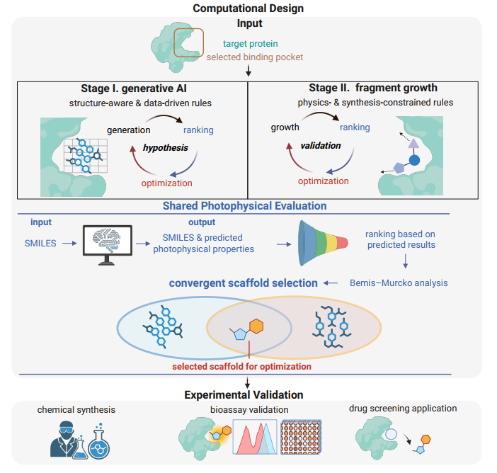

# Convergent Structure-Guided Design of Target-Specific Fluorescent Probes with Application to α-Synuclein Ligand Discovery  

## ABSTRACT

Target-specific fluorescent probes are versatile tools for target visualization. However, rational probe design is constrained by the dual challenges of optimizing target binding and photophysical performance, as these two objectives are governed by distinct and often competing chemical principles. Here, we introduce a convergent strategy that integrates structure-aware generative artificial intelligence with physics- and synthesis-constrained fragment growth to generate targetstructure-guided molecules, both of which operate within a shared photophysical framework that promotes convergent scaffold discovery. Applied to α-synuclein fibrils, a central target in Parkinson’s disease, our strategy converged on a new probe (CLead1), which was subsequently validated to exhibit a strong turn-on response and exceptional selectivity over other amyloids. CLead1 further enabled high-throughput screening that identified Dryocrassin ABBA as a neuroprotective inhibitor of α-synuclein fibrillization. This work establishes a general strategy for advancing target-specific fluorescent probe discovery from visualization and screening towards therapeutic exploration.



## Installation

### Installation of Proby

clone the repo:

```bash
git clone https://github.com/Kirinwinn/proby.git
```

create the environment:

```bash
conda create --name Proby python==3.12.12
```

cd into the directory:

```bash
cd proby
```

install:

```bash
pip install -r requirements.txt
conda activate Proby
conda install ipykernel
python -m ipykernel install --user --name "Proby" --display-name "Proby"
```

### Installation of Delete

clone the repo:

```bash
git clone https://github.com/Kirinwinn/Delete.git
```

cd into the directory:

```bash
cd Delete
```

create the environment and install:

```bash
conda env create -f delete_environment.yml
conda activate Delete
conda install ipykernel
python -m ipykernel install --user --name "Delete" --display-name "Delete"
```

## Model Download

### Proby Model Download 

The proby models can be accessed from [weights](https://drive.google.com/drive/folders/1oEL6XBQZXhrMlU0YYn5407uNH8383KhW?usp=sharing). Put the downloaded model files into `proby/models/model_1` and `proby/models/model_2` respectively.

### Delete Model Download

The delete model can be accessed from [weights](https://drive.google.com/file/d/1wMsWWtyHzlsnVVbIvsx41vTno6OisEFf/view?usp=sharing). Put the downloaded model files into `delete/checkpoint`

## Usage

### Usgae of Proby

Prepare one or more `.xlsx` or `.csv` files containing a `SMILES` column (case-insensitive). 

Put these files into `Proby/input_preparation` and simple run the notebook named `Proby_AutoRunning`.

### Usage of Delete

Prepare the `.ply` and `.sdf` file. Put these files into `delete/data` and run the command below:

```bash
python -u delete.py   \
  --surf_path ./data/x.ply   \
  --frag_path ./data/CRNA/x.sdf  \
  --check_point ./checkpoint/ckpt/delete.pt   \
  --outdir ./outputs   \
  --suboutdir 
```

You can also use the notebook named `Delete_AutoRunning`

### Scaffolds Analysis

You can use the `DataProcessing` notebook to analyze and aggregate molecules generated by **Delete** and prediction results from **Proby**, followed by scaffold analysis using `ScaffoldsAnalysis.ipynb`

## About Stage II

Stage II (Fragment Growth): For the detailed methodology and algorithmic implementation of the physics- and synthesis-constrained fragment growth, please refer to our article.

## Data Availability

The full generated molecules are available via [Results](https://drive.google.com/drive/folders/1aHaBdnGhWgqtKcty-11vZRvMFl2dvNGx?usp=drive_link)

## Acknowledgments

We acknowledge the contributions of the following projects:

**DELETE:** We thank Haotian Zhang et al. for the [DELETE](https://github.com/HaotianZhangAI4Science/Delete) model and their unified deleting strategies.

**Proby:** We thank the authors and developers of the [Proby](https://github.com/18lyb12/proby) model.

## License

This project is licensed under the **GPLv3 License**. 
Please refer to the `LICENSE` file for details. 

**Note on Usage:**
This repository integrates code from [Proby](https://github.com/18lyb12/proby), which is licensed under GPLv3. Consequently, this entire project is distributed under the same terms.
